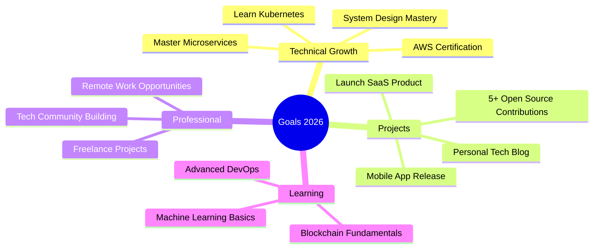

<div align="center">

# 👨‍💻 Amine Added


[](https://git.io/typing-svg)

<p align="center">
  
  
</p>

</div>

---

## 🎭 About Me


```javascript
const amine = {
    pronouns: "He/Him",
    location: "Tunisia 🇹🇳",
    role: "Full Stack Developer",
    status: "IT Student",
    
    expertise: {
        frontend: ["Vue.js", "Angular", "React", "TypeScript"],
        backend: ["Spring Boot", "Laravel", "Flask", "Node.js"],
        mobile: ["Flutter", "Kotlin"],
        databases: ["MySQL", "MongoDB", "Firebase"],
        devops: ["Docker", "Git", "Linux"]
    },
    
    currentlyLearning: [
        "🏗️ Microservices Architecture",
        "☁️ Cloud Computing (AWS/Azure)",
        "🔐 Cybersecurity Best Practices",
        "🤖 AI/ML Integration"
    ],
    
    passions: ["Clean Code", "Problem Solving", "Open Source"],
    funFact: "I debug with console.log() and I'm not ashamed! 😄"
};
```

<br clear="right"/>

---

## 🛠️ Technology Stack

<div align="center">

### Frontend Development


### Backend Development


### Mobile Development


### Databases & Cloud


### DevOps & Tools


### Design Tools


</div>

---

## 📊 GitHub Statistics

<div align="center">
  
  
</div>

<div align="center">
  
  
</div>

---

## 🏆 GitHub Trophies

<div align="center">
  
[](https://github.com/ryo-ma/github-profile-trophy)

</div>

---

## 📈 Contribution Graph

<div align="center">


</div>

---

## 🎯 2026 Roadmap

<div align="center">



</div>

---

## 💼 Featured Work

<div align="center">

### 🚀 Project Highlights

Coming soon! I'm working on exciting projects that will be showcased here.

**Stay tuned for:**
- 🌐 Full-stack web applications
- 📱 Cross-platform mobile apps
- 🔧 Open-source contributions
- 💡 Innovative solutions

</div>

---

## 🌐 Connect With Me

<div align="center">

[](https://linkedin.com/in/amineadded)
[](https://fb.com/amine%20added)
[](https://instagram.com/amineadded05)
[](https://twitter.com/amineadded)
[](https://codeforces.com/profile/amineadded)
[](mailto:amineadded3@gmail.com)

<br>

### 💬 Let's Collaborate!

**I'm open to:**
- 🤝 Collaboration on interesting projects
- 💼 Freelance opportunities
- 🎓 Mentorship and knowledge sharing
- 🚀 Building something amazing together

</div>

---

## 🎮 Interactive Games - Play Now!

<div align="center">

### 🎯 Click to Play These Interactive Games!

<table>
  <tr>
    <td align="center" width="50%">
      <a href="https://codepen.io/pen?template=xxQZdzP">
        
      </a>
      <br><sub><b>Play the classic hand game!</b></sub>
    </td>
    <td align="center" width="50%">
      <a href="https://codepen.io/pen?template=MWRaZeP">
        
      </a>
      <br><sub><b>Strategic 3x3 grid game!</b></sub>
    </td>
  </tr>
  <tr>
    <td align="center" width="50%">
      <a href="https://codepen.io/pen?template=KKOqReN">
        
      </a>
      <br><sub><b>Classic arcade snake!</b></sub>
    </td>
    <td align="center" width="50%">
      <a href="https://codepen.io/pen?template=abYZKmR">
        
      </a>
      <br><sub><b>Test your memory skills!</b></sub>
    </td>
  </tr>
  <tr>
    <td align="center" width="50%">
      <a href="https://codepen.io/pen?template=rNqwxYP">
        
      </a>
      <br><sub><b>Can you guess the number?</b></sub>
    </td>
    <td align="center" width="50%">
      <a href="https://codepen.io/pen?template=ZEPwXKm">
        
      </a>
      <br><sub><b>How fast are your reflexes?</b></sub>
    </td>
  </tr>
</table>

<br>

**🏆 Challenge yourself with these fun games! Click any badge to start playing!**

<sub>💡 Tip: These games are hosted on CodePen and fully functional. Fork them to customize!</sub>

</div>

---

## 💭 Daily Inspiration

<div align="center">


</div>

---

## ⚡ Quick Facts

<div align="center">

```typescript
interface DeveloperLife {
  coffee: number;
  code: string[];
  bugs: "features";
  sleep: boolean;
}

const myLife: DeveloperLife = {
  coffee: Infinity,
  code: ["morning", "afternoon", "evening", "night"],
  bugs: "features",
  sleep: false  // TODO: Fix this
};
```

</div>

---

<div align="center">

### 🐍 Contribution Snake Animation


<sub>⚠️ **Note:** If the snake animation doesn't appear, you'll need to set up the GitHub Action workflow. Check the repository for setup instructions.</sub>

---

### 📊 Coding Activity

<!--START_SECTION:waka-->
<!--END_SECTION:waka-->

<sub>⚠️ **Note:** To display WakaTime stats, configure WakaTime integration in your repository settings.</sub>

---


### 💙 Thanks for visiting!

**Made with ❤️ and lots of ☕ by Amine Added**

*"Code is like humor. When you have to explain it, it's bad." – Cory House*

</div>
