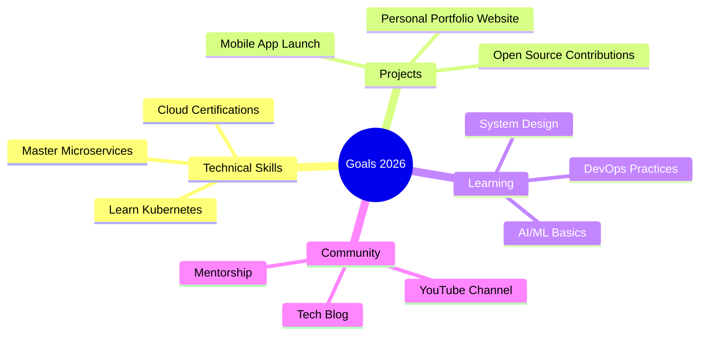

<div align="center">

# 👨‍💻 Amine Added


[](https://git.io/typing-svg)

<p align="center">
  
  
  
</p>

</div>

---

## 🎭 About Me


```javascript
const amine = {
    pronouns: "He/Him",
    location: "Tunisia 🇹🇳",
    role: "Full Stack Developer",
    company: "IT Student",
    
    code: {
        frontend: ["Vue.js", "Angular", "React", "HTML/CSS", "Bootstrap"],
        backend: ["Spring Boot", "Laravel", "Flask", "Node.js"],
        mobile: ["Flutter", "Kotlin"],
        databases: ["MySQL", "MongoDB", "Firebase"],
        languages: ["Java", "JavaScript", "Python", "PHP", "C/C++"]
    },
    
    currentFocus: [
        "🎯 Mastering Spring Boot Microservices",
        "🌐 Advanced Vue.js Patterns",
        "📱 Flutter Cross-Platform Development",
        "☁️ Cloud Architecture & DevOps"
    ],
    
    funFact: "I debug with console.log() and I'm not ashamed! 😄"
};
```

<br clear="right"/>

---

## 🛠️ Technology Arsenal

<details open>
<summary><b>🎨 Frontend Magic</b></summary>
<br>

| Category | Technologies |
|----------|-------------|
| **Core** |     |
| **Frameworks** |    |
| **Styling** |    |

</details>

<details open>
<summary><b>⚙️ Backend Power</b></summary>
<br>

| Category | Technologies |
|----------|-------------|
| **Languages** |    |
| **Frameworks** |    |
| **Databases** |    |

</details>

<details open>
<summary><b>📱 Mobile Development</b></summary>
<br>


</details>

<details open>
<summary><b>🔧 DevOps & Tools</b></summary>
<br>


</details>

<details>
<summary><b>🎨 Design & Visualization</b></summary>
<br>


</details>

---

## 📊 GitHub Analytics

<div align="center">


</div>

---

## 🏆 Achievements & Trophies

<div align="center">

[](https://github.com/ryo-ma/github-profile-trophy)

</div>

---

## 📈 Contribution Activity

<div align="center">


</div>

---

## 💼 Featured Projects

<div align="center">

[](https://github.com/amineadded/PROJECT_NAME_1)
[](https://github.com/amineadded/PROJECT_NAME_2)

</div>

---

## 🎯 Current Goals for 2026



---

## 🌐 Connect & Collaborate

<div align="center">

[](https://fb.com/amine%20added)
[](https://instagram.com/amineadded05)
[](https://linkedin.com/in/amineadded)
[](https://twitter.com/amineadded)
[](https://codeforces.com/profile/amineadded)
[](mailto:amineadded3@gmail.com)

<br>

### 📬 Let's Build Something Amazing Together!

**Open for collaborations, freelance projects, and interesting opportunities.**

</div>

---

## 💭 Developer Quote

<div align="center">


</div>

---

## 🎵 Spotify Playing

<div align="center">

[](https://open.spotify.com/user/YOUR_SPOTIFY_ID)

</div>

---

## 📊 Weekly Development Breakdown

<!--START_SECTION:waka-->
<!--END_SECTION:waka-->

---

<div align="center">

### 🐍 Contribution Snake


---

### ⚡ Fun Fact

```
while(alive) {
    eat();
    sleep();
    code();
    repeat();
}
```

---


**Made with ❤️ and lots of ☕ by Amine Added**


</div>
